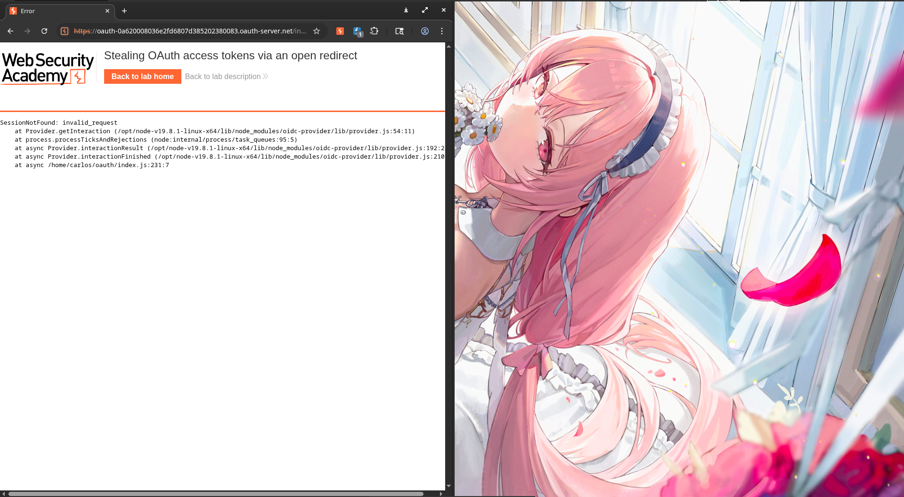

# PortSwigger Web Security Academy Labs & Writeups

Welcome to my repository containing comprehensive notes, vulnerability fundamentals, and structured Proof of Concept (PoC) writeups for the PortSwigger Web Security Academy.

This repository serves as a reference for understanding web vulnerabilities, their root causes, and exploitation methodologies.

---

## Repository Structure

Each category contains:
1. `Fundamentals.md` - Theoretical notes, detection methodologies, and defensive strategies for the specific vulnerability class.
2. `Writeup.md` - Structured, step-by-step Proof of Concept (PoC) walkthroughs for the academy labs.
3. Supporting scripts, configurations, and assets (e.g. customized exploit scripts and target wordlists).

```
PORTSWIGGER-LABS/
├── 00-SQLI-Labs/          # SQL Injection
├── 01-XSS-Labs/           # Cross-Site Scripting (XSS)
├── 02-BAC-Labs/           # Broken Access Control (BAC)
├── 03-BLF-Labs/           # Business Logic Flaws
├── 04-API-Labs/           # API Testing
├── 05-JWT-Labs/           # JSON Web Tokens (JWT) Attacks
├── 06-CSRF-Labs/          # Cross-Site Request Forgery (CSRF)
├── 07-OAUTH-Labs2.0/      # OAuth 2.0 & OIDC
├── 08-AUTH-Labs/          # Authentication Attacks
├── 09-DOM-Labs/           # DOM-based Vulnerabilities & DOM Clobbering
└── 10-RaCo-Labs/          # Web Race Conditions (Concurrency)
```

---

## Vulnerability Categories Covered

- **[00-SQLI-Labs](file:///home/ardxcryz/PORTSWIGGER-LABS/00-SQLI-Labs/)**: Retrieving hidden data, UNION-based exfiltration, database version querying, and database schema dumping on Oracle and MySQL.
- **[01-XSS-Labs](file:///home/ardxcryz/PORTSWIGGER-LABS/01-XSS-Labs/)**: Reflected, Stored, and DOM-based XSS, WAF bypasses (custom tag manipulation, SVG event handlers), cookie stealing, and CSRF injection.
- **[02-BAC-Labs](file:///home/ardxcryz/PORTSWIGGER-LABS/02-BAC-Labs/)**: Vertical and Horizontal access control bypasses, Insecure Direct Object References (IDOR), HTTP method overrides, and referer-based controls.
- **[03-BLF-Labs](file:///home/ardxcryz/PORTSWIGGER-LABS/03-BLF-Labs/)**: Logic flaws involving excessive trust in client inputs, integer overflows, email address truncation discrepancies, and workflow state machine bypasses.
- **[04-API-Labs](file:///home/ardxcryz/PORTSWIGGER-LABS/04-API-Labs/)**: API reconnaissance, dynamic swagger schema exploitation, Mass Assignment, and Server-Side Parameter Pollution (SSPP) in query strings and REST URLs.
- **[05-JWT-Labs](file:///home/ardxcryz/PORTSWIGGER-LABS/05-JWT-Labs/)**: Session hijacking using algorithm manipulation (`none`), weak HMAC secret cracking, and header injections (`jwk`, `jku`, `kid` path traversal).
- **[06-CSRF-Labs](file:///home/ardxcryz/PORTSWIGGER-LABS/06-CSRF-Labs/)**: anti-CSRF token bypasses, cookie-to-token validation flaws, SameSite restrictions bypasses (Strict, Lax), and Referer spoofing.
- **[07-OAUTH-Labs2.0](file:///home/ardxcryz/PORTSWIGGER-LABS/07-OAUTH-Labs2.0/)**: Implicit grant flow bypasses, profile linking CSRF, authorization code exfiltration via open redirect parameters, and Dynamic Client Registration SSRF.
- **[08-AUTH-Labs](file:///home/ardxcryz/PORTSWIGGER-LABS/08-AUTH-Labs/)**: Username enumeration (timing and response discrepancies), 2FA bypasses, brute-force rate-limiting bypasses, and Host header poisoning.
- **[09-DOM-Labs](file:///home/ardxcryz/PORTSWIGGER-LABS/09-DOM-Labs/)**: Client-side message listening vulnerabilities, DOM-based redirects, cookie manipulations, and DOM Clobbering (overwriting globals and bypassing HTMLJanitor sanitizers).
- **[10-RaCo-Labs](file:///home/ardxcryz/PORTSWIGGER-LABS/10-RaCo-Labs/)**: Concurrency testing via single-packet multiplexing (HTTP/2), TOCTOU limit overruns, multi-endpoint state races, and partial construction state exploits.

---

## Disclaimers
This repository is created strictly for educational purposes and cybersecurity research. All techniques described herein were executed in authorized environments (PortSwigger Web Security Academy).



